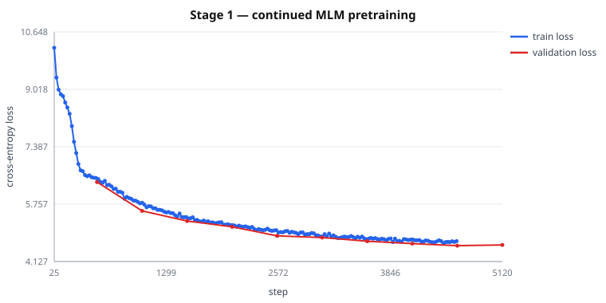
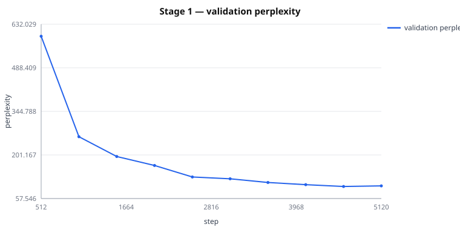

# Stage 1 — Final MLM Report

Run `checkpoints/vexmlm-stage1`, SLURM job 60584

## Outcome

| Metric | Value |
|---|---|
| Best validation loss | **4.5764** (step 4608) |
| Best perplexity | **97.17** |
| Final validation loss | 4.5850 |
| Final perplexity | 98.00 |
| Final training loss | 5.3492 |
| Wall clock | 21.0 min |
| Throughput | 130.17 sequences/s |
| Token throughput | ~33,323 tokens/s |

## Per-epoch validation

| Epoch | Step | Val loss | Perplexity |
|---|---|---|---|
| 1.00 | 512 | 6.3842 | 592.41 |
| 2.00 | 1024 | 5.5654 | 261.23 |
| 3.00 | 1536 | 5.2780 | 195.97 |
| 4.00 | 2048 | 5.1143 | 166.38 |
| 5.00 | 2560 | 4.8569 | 128.62 |
| 6.00 | 3072 | 4.8091 | 122.62 |
| 7.00 | 3584 | 4.7037 | 110.35 |
| 8.00 | 4096 | 4.6360 | 103.13 |
| 9.00 | 4608 | 4.5764 | 97.17 |
| 10.00 | 5120 | 4.5978 | 99.27 |

### Overfitting check

Validation loss rose at 1 of 9 epoch transitions.

Validation loss ended at 4.5978, above its best 4.5764 at step 4608 — divergence after the best epoch. Training ran the full schedule as specified; `load_best_model_at_end` means the **saved model is the best checkpoint, not the last**.

## Training curves

184 training points, 10 validation points.

## Effective token count

| Split | Lines | Blocks | Tokens |
|---|---|---|---|
| train | 261,941 | 16,376 | 4,192,256 |
| validation | 2,645 | 164 | 41,984 |

**4,234,240 subword tokens per epoch**, every one of them real: block-chunking leaves no padding. Over 10 epochs the model sees 42,342,400 token positions, of which ~15% are masked (6,351,360 prediction targets).

## Deduplication impact

| Corpus | Raw lines | Duplicates removed | Kept | Rate |
|---|---|---|---|---|
| amharic | 200,002 | 70,070 | 129,402 | 35.03% |
| tigrinya | 200,000 | 59,164 | 140,583 | 29.58% |

Without deduplication a line repeated 160× would contribute 160 gradient updates per epoch and could appear in both train and validation, making held-out perplexity measure memorized text.

## Vocabulary firing statistics

| Metric | Value |
|---|---|
| Sentences probed | 2,000 |
| Tokens | 28,383 |
| New-token firings | 16,045 |
| **Share of tokens from new vocabulary** | **56.53%** |
| Status | OK |

Measured on held-out Tigrinya before Stage 1. The expanded vocabulary is genuinely used, not inert.

## Hardware

| Field | Value |
|---|---|
| GPU | NVIDIA A100 80GB PCIe |
| VRAM | [79.27] |
| CUDA | 11.8 |
| BF16 | True |
| Devices | 1 |
| Effective batch | 32 |
| PyTorch | 2.5.1+cu118 |

- GPU 0 `NVIDIA A100 80GB PCIe`: 0.0% util, 4.0 MB used of 81920.0 MB (sampled at start)

## Checkpoint

| Artifact | Value |
|---|---|
| Path | `checkpoints/vexmlm-stage1` |
| Size | 1.21 GB |
| SHA-256 (first 64 MB) | `8023edb3cb8a3e593dcbb49326101357` |
| Selection | best by `eval_loss` (`load_best_model_at_end`) |

## Configuration

Paper Table 1, unchanged:

| Parameter | Value |
|---|---|
| max_seq_length | 256 |
| batch size | 32 |
| epochs | 10 |
| learning rate | 5e-5 |
| optimizer | AdamW |
| weight decay | 0.01 |
| mlm_probability | 0.15 |
| gradient clipping | 1.0 |
| precision | bf16 |
| trainable | all parameters |
| example construction | block-chunked (approved) |
